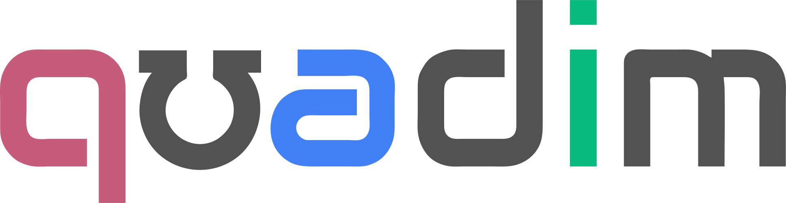

Design resources and assets
===========================

Collection of useful design resources and assets for use in the Quadim
ecosystem.

***IMPORTANT***: This readme along with exports are generated via
[builder](bin/builder), do not edit directly, instead use
[template](templates/README.hbs)

## Building

This project is generated from the [palette.json](palette.json) file, and a [Makefile](Makefile).
Update pre-requesits like palette or template, and then call `make`.

To generate a single file, touch & call `make exports/quadim.sass`

## Package

The colors object is exposed in package:

```
"@quadimai/quadim-colors": "1.0.1",
```

To build a new version you need an access token, @roosta for credentials

To use you'd `import colors from "@quadimai/quadim-colors"`, then `colors.blue.hex` for example.

## Palette

This palette is a **work in progress**, changed are expected, make sure to keep repo up to date

| Img                                                                  | Name             | Hex             | RGB                  | HSL                  | Bulma/Buefy           | Sass              | Score                     |
|----------------------------------------------------------------------|------------------|-----------------|----------------------|----------------------|-----------------------|------------------|---------------------------|
|    | Blue  | #4280F8  | 66, 128, 248  | 220, 93%, 62%  | is-blue, is-primary, is-brand  | $color--blue   | Solid |
|    | Steel  | #4B84AA  | 75, 132, 170  | 204, 39%, 48%  | is-steel  | $color--steel   | Not used |
|    | Green  | #07BB7E  | 7, 187, 126  | 160, 93%, 38%  | is-green, is-success  | $color--green   | Apprentice |
|    | Orange  | #DF9153  | 223, 145, 83  | 27, 69%, 60%  | is-orange, is-warning  | $color--orange   | No Score |
|    | Purple  | #8C72E5  | 140, 114, 229  | 254, 69%, 67%  | is-purple  | $color--purple   | Expert |
|    | Cinnamon  | #C65B7C  | 198, 91, 124  | 341, 48%, 57%  | is-cinnamon  | $color--cinnamon   | Not used |
|    | Rose  | #F14668  | 241, 70, 104  | 348, 86%, 61%  | is-rose, is-danger  | $color--rose   | Not used |
|    | Granite  | #525252  | 82, 82, 82  | 0, 0%, 32%  | is-granite, is-dark  | $color--granite   | Not used |
|    | Basalt  | #636373  | 99, 99, 115  | 240, 7%, 42%  | is-basalt  | $color--basalt   | Not used |
|    | Bone  | #DBE0E9  | 219, 224, 233  | 0, 0%, 88%  | is-bone  | $color--bone   | Not used |
|    | Silver  | #E0E0E0  | 224, 224, 224  | 0, 0%, 88%  | is-silver  | $color--silver   | Not used |
|    | Magenta  | #C65B7C  | 198, 91, 124  | 341, 48%, 57%  | is-magenta  | $color--magenta   | Craftsperson |
|    | Yellow  | #FFC857  | 255, 200, 87  | 40, 100%, 67%  | is-yellow  | $color--yellow   | Novice |
|    | Cyan  | #54DEFD  | 84, 222, 253  | 191, 98%, 66%  | is-cyan  | $color--cyan   | Not used |

### Exports

- [GIMP/Inkscape (gpl)](exports/quadim.gpl)
- [SASS](exports/quadim.sass)
- [HTML](exports/quadim.html)
- [Text file](exports/quadim.txt)

## Typography

General typography such as sizes, weights etc follows Bulma, but if you’re not using a framework, see below

- Root (html/body) font size: `16px`

### Font

- Main font family: [Noto Sans](https://fonts.google.com/noto)
- Fallback font: [Roboto](https://fonts.google.com/specimen/Roboto)

### Sizes

| Size | Font-size | Bulma class |
|------|-----------|-------------|
| 1    | 3rem      | is-size-1   |
| 2    | 2.5rem    | is-size-2   |
| 3    | 2rem      | is-size-3   |
| 4    | 1.5rem    | is-size-4   |
| 5    | 1.25rem   | is-size-5   |
| 6    | 1rem      | is-size-6   |
| 7    | 0.75rem   | is-size-7   |

## Spacing

- [Spacing helpers | Bulma: Free, open source, and modern CSS framework based on Flexbox](https://bulma.io/documentation/helpers/spacing-helpers/)

We'll try to be consistent with spacing, refer to this table for sizes. In Bulma you can use these by adding `m-2`, which will set margin to 2. You can also set a direction like this: `mr-2`, this will set right margin. Same applies to padding.

| Suffix | Value   |
|--------|---------|
| *-0    | 0       |
| *-1    | 0.25rem |
| *-2    | 0.5rem  |
| *-3    | 0.75rem |
| *-4    | 1rem    |
| *-5    | 1.5rem  |
| *-6    | 3rem    |

## Assets


<hr></hr>


<hr></hr>


<hr></hr>


<hr></hr>
